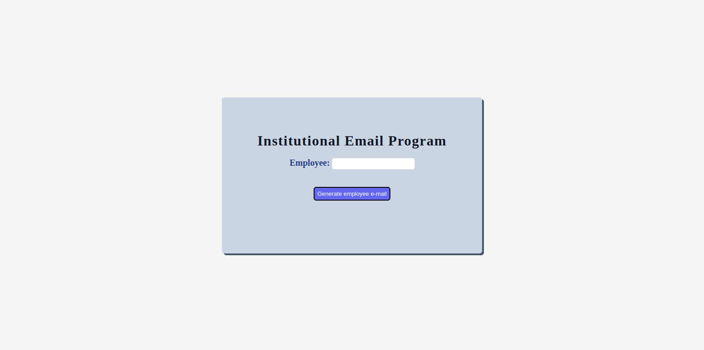
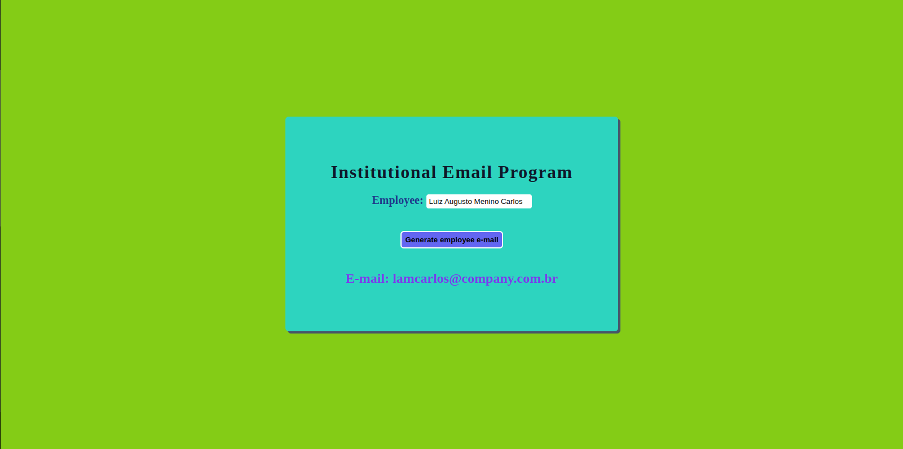
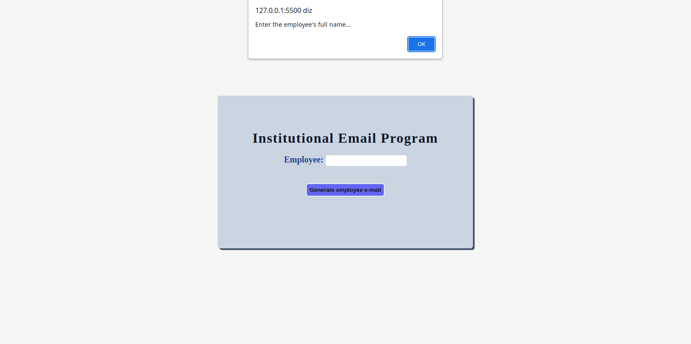
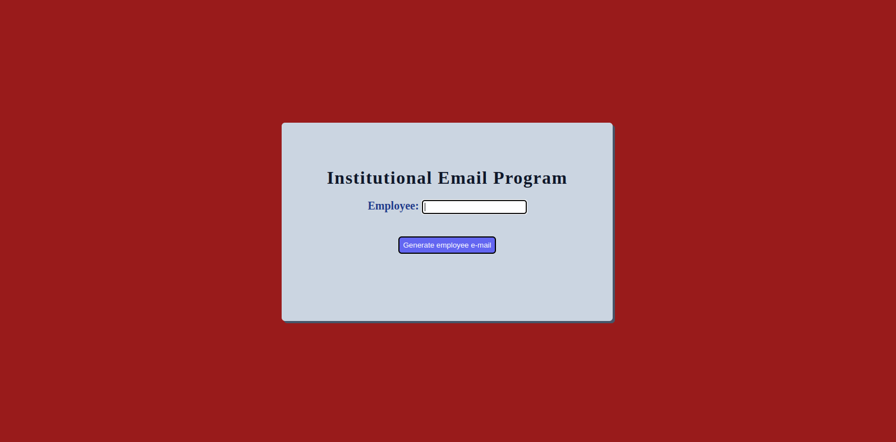

<h1 align="center"> Gerar E-mail </h1>

 

<h3 align="center">Tela inicial</h3>

 
  

## 🚀 Tecnologias

Esse projeto foi desenvolvido com as seguintes tecnologias:

- HTML e CSS
- JavaScript

 
<h3 align="center">Gerando E-mail </h3>

 
  

 

 
<h3 align="center">Validação feita</h3>

 
  

 

 
<h3 align="center">Após a validação </h3>

 
  

 

## 💻 Projeto

A ideia do programa **Gerar e-mail**, foi retirado do livro **Lógica de Programação e Algoritmos com JavaScript** da editora **Novatec**. O programa foi alterado de forma totalmente pessoal para o treino das tecnologias utilizadas.
